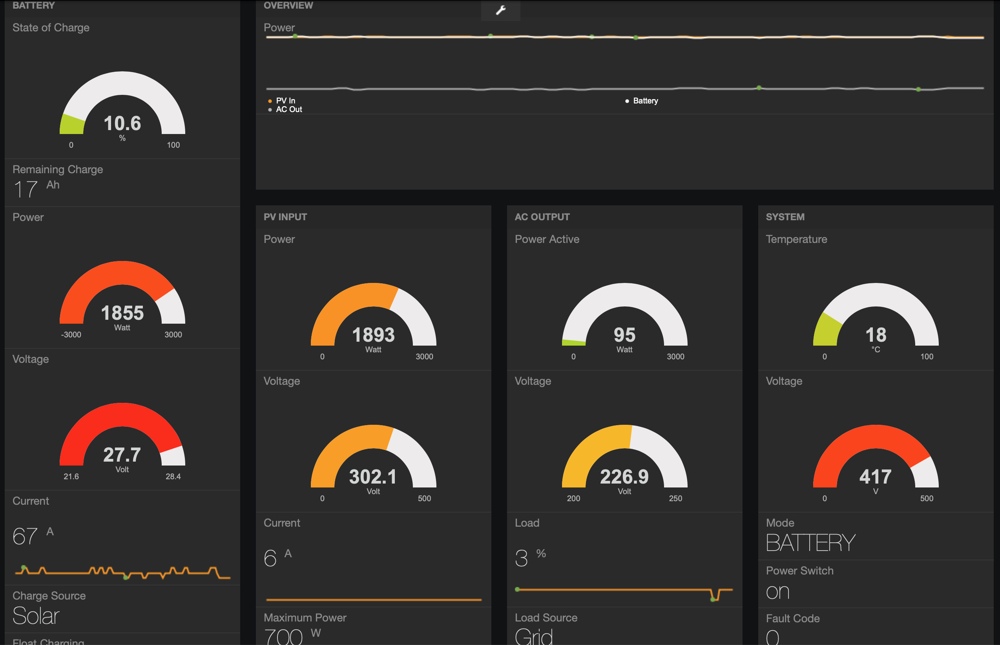
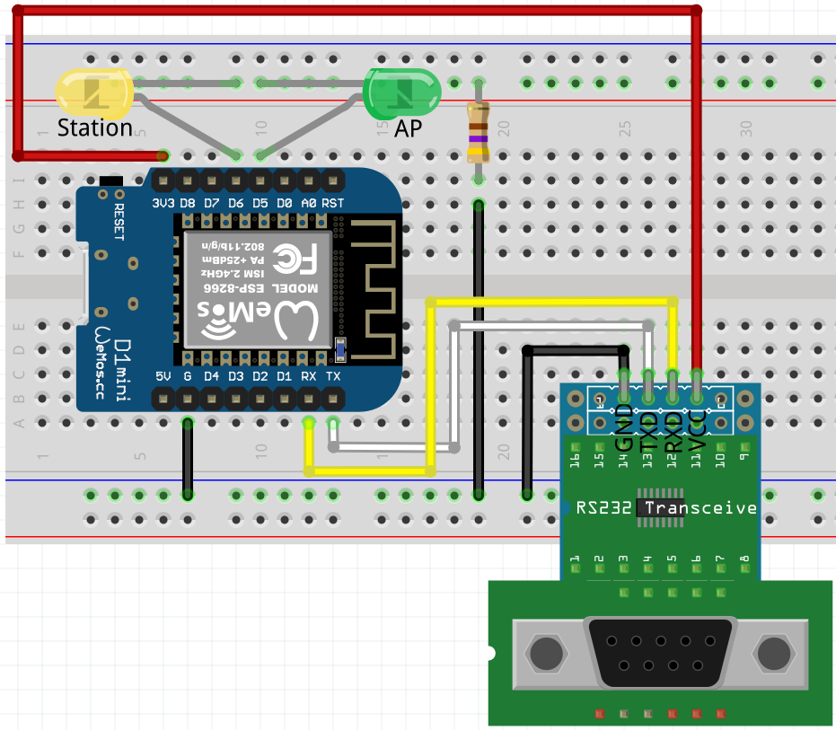

# SolarInverterToWeb
Read data via RS-232 interface from inverter and present it as a dashboard or JSON via WiFi/HTTP.
The dashboard is available on http://192.168.4.1 and the raw JSON on http://192.168.4.1/data .
The solution is implemented on an ESP8266 but is likely to work on other ESP or Arduino boards with small modifications.



The device acts as an access point (SSID: solar, Pwd: inverter) and also tries to connect to a WLAN as client in order to send the maximum available solar power to a consumer (e.g. an electric car). The purpose being that the consumer adjusts its consumption so it uses only power generated by the PV array and not the battery or the grid. This way the consumer can draw the maximum available solar power (actually that was the whole purpose of this solution, not the fancy dashboard).

Use TX/RX pins and a RS-232-to-TTL converter to connect to many of the standard solar inverters from China.

Schema:


Example JSON output: 
```
{
  "grid": {
    "voltage": 235.5,
    "frequency": 49.9
  },
  "out": {
    "voltage": 235.5,
    "frequency": 49.9,
    "powerApparent": 1818,
    "powerActive": 1818,
    "load": 60
  },
  "battery": {
    "voltage": 2.4,
    "voltageSCC": 0,
    "currentCharge": 0,
    "currentDischarge": 0,
    "soc": 0
  },
  "pv": {
    "voltage": 208.4,
    "current": 5,
    "power": 1159
  },
  "system": {
    "status": 16,
    "mode": 10,
    "version": 0,
    "voltage": 368,
    "temperature": 28,
    "fanCurrent": 0
  }
}
```

Be aware that you have to test the integration by yourself and make sure no device gets damaged. The code is provided as-is and the author takes no responsibility for any damage caused by its use.

Recommended setup:
* ESP8266 v2.7.4, WeMos D1 R	1
* Upload Speed: 921600
* Debug Port: disabled
* Flash Size: 4MB (FS: 2MB OTA:~1019KB)
* Exceptions: Disabled (new can abort)
* IwIP Variant: v2 Higher Bandwidth
* Debug Level: None
* SSL Support: Basic SSL ciphers
* VTables: IRAM
* Erase Flash: Only Sketch
* CPU Frequency: 160MHz
